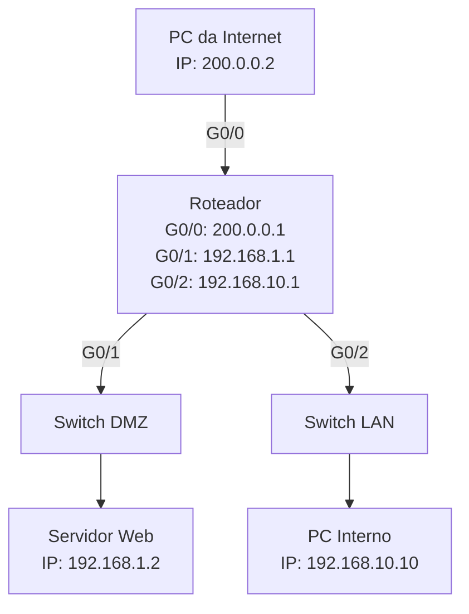

## DMZ (Zona Desmilitarizada)


### Objetivo

Permitir que usuários da Internet acessem um servidor web na DMZ, mas **impedir o acesso à rede interna**.

---

### Topologia Simples




#### Legenda da Topologia

* **INTERNET → R1 (G0/0):** simula o acesso externo
* **R1 → Switch DMZ (G0/1):** conecta à zona pública (DMZ)
* **R1 → Switch LAN (G0/2):** conecta à rede privada interna
* **ACL no G0/0:** restringe o tráfego da Internet apenas à DMZ


---

### Endereçamento IP

| Rede         | IP/Sub-rede     | Interface do roteador |
| ------------ | --------------- | --------------------- |
| Internet     | 200.0.0.0/30    | G0/0                  |
| DMZ          | 192.168.1.0/24  | G0/1                  |
| Rede Interna | 192.168.10.0/24 | G0/2                  |

---

### Script de configuração (Roteador)

```bash
enable
configure terminal

! Interfaces
interface GigabitEthernet0/0
 ip address 200.0.0.1 255.255.255.252
 no shutdown

interface GigabitEthernet0/1
 ip address 192.168.1.1 255.255.255.0
 no shutdown

interface GigabitEthernet0/2
 ip address 192.168.10.1 255.255.255.0
 no shutdown

! Roteamento estático (Internet simulada via host com IP 200.0.0.2)
ip route 0.0.0.0 0.0.0.0 200.0.0.2

! ACL para proteger a rede interna (bloquear tráfego vindo da Internet)
access-list 100 permit tcp any host 192.168.1.2 eq 80
access-list 100 deny ip any 192.168.10.0 0.0.0.255
access-list 100 permit ip any any

interface GigabitEthernet0/0
 ip access-group 100 in

end
write memory
```

---

### Configuração de dispositivos

#### Servidor Web (na DMZ)

* IP: `192.168.1.2`
* Gateway: `192.168.1.1`
* Serviço HTTP: ativado

#### PC Interno

* IP: `192.168.10.10`
* Gateway: `192.168.10.1`

#### PC da Internet

* IP: `200.0.0.2`
* Gateway: `200.0.0.1`

---

### Testes

* O **PC da Internet** deve conseguir acessar `http://192.168.1.2`.
* O **PC da Internet** não deve conseguir **pingar ou acessar** `192.168.10.10`.
* O **PC Interno** pode acessar a **Internet e a DMZ** livremente.
