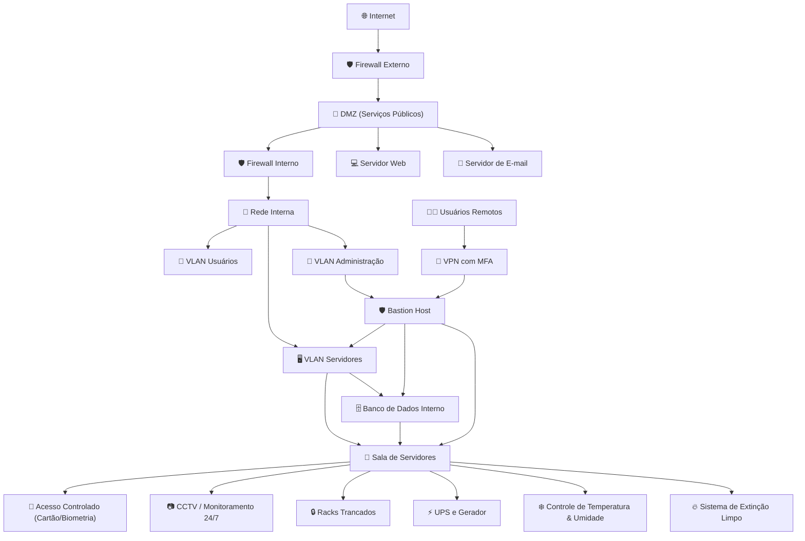

# Aula 06 — Segurança Física e Topologias de Segurança

## 1. Conceito de Segurança Física

A **segurança física** refere-se a todas as medidas implementadas para proteger ativos tangíveis — como servidores, estações de trabalho, cabos de rede, mídias de backup e equipamentos de telecomunicações — contra acessos não autorizados, desastres ambientais e falhas operacionais.

Ela complementa a **segurança lógica**, pois muitas invasões digitais têm origem em falhas físicas, como:

* **Tailgating:** um intruso entra junto com um funcionário autorizado, aproveitando-se da confiança ou descuido.
* **Roubo de dispositivos:** notebooks, HDs externos ou servidores podem conter dados sensíveis.
* **Instalação de dispositivos maliciosos:** como keyloggers, câmeras ou sniffers de rede.

**Princípios básicos da segurança física:**

* **Dissuadir (Deter):** barreiras físicas, sinalização clara, políticas de segurança visíveis.
* **Detectar:** sensores de presença, câmeras de vigilância, alarmes sonoros e sistemas de monitoramento.
* **Atrasar (Delay):** portas reforçadas, mantraps (duas portas sequenciais que permitem entrada controlada), racks trancados.
* **Responder:** equipe treinada, plano de incidentes, monitoramento 24/7.

**Exemplo:** Uma sala de servidores com porta biométrica, alarme sonoro e câmeras integradas. Caso alguém tente forçar a porta, o alarme dispara, e a equipe de segurança é notificada imediatamente, enquanto o intruso fica “atrasado” pela porta reforçada.


## 2. Áreas Seguras e Controles de Acesso

### Requisitos mínimos para ambientes corporativos:

* **Perímetro:** cercas, portões controlados, recepção monitorada com vigilantes.
* **Portas de acesso:** cartões magnéticos, biometria ou senha, preferencialmente com **autenticação multifatorial (MFA)**.
* **Mantraps:** duas portas em sequência; somente uma abre por vez, evitando entrada de intrusos acompanhando funcionários.
* **Zonas de segurança:**

  * Pública → restrita → crítica (ex.: sala de servidores).
* **CCTV (Closed Circuit Television):** câmeras cobrindo entradas, corredores e áreas críticas, com retenção mínima de 30 dias.
* **Controle de visitantes:** registro de entrada, crachás temporários, acompanhamento obrigatório.

**Exemplo:** Uma empresa possui um hall de entrada com recepção. Visitantes recebem crachá temporário, só podendo acessar áreas públicas. Para entrar na sala de servidores, é necessário autenticação biométrica, e todas as ações são gravadas por CCTV.


## 3. Proteção contra Falhas Ambientais

### Energia

* **UPS (Uninterruptible Power Supply):** fornece energia imediata durante quedas ou oscilações, evitando desligamentos abruptos.
* **Geradores:** mantêm operação contínua durante longas interrupções de energia.
* **Redundância:** duas fontes independentes de energia garantem continuidade, mesmo se uma falhar.

**Exemplo:** Um servidor crítico recebe energia via UPS e gerador. Caso falte energia, o UPS mantém operação por minutos até o gerador entrar em funcionamento.

### Climatização (HVAC)

* Temperatura ideal: **18 a 27 °C**
* Umidade relativa: **40% a 60%**
* Monitoramento contínuo com alertas automáticos em caso de falha.

**Exemplo:** Sensores detectam aumento de temperatura acima de 27 °C, enviando alertas automáticos ao administrador e ajustando o ar-condicionado do data center.

### Incêndio

* Detectores de fumaça e sensores aspirativos.
* Sistemas de extinção com agentes limpos (FM-200, Novec) que não danificam equipamentos.
* Planos de evacuação e simulações periódicas.

**Exemplo:** Um detector de fumaça ativa o sistema de extinção com FM-200, preservando os servidores, enquanto os funcionários são evacuados com segurança.


## 4. Topologias de Segurança em Redes

### Bastion Host

Servidor altamente protegido, usado como **ponto seguro de administração** de sistemas internos.

* Apenas serviços essenciais devem estar ativos.
* Exemplo de **hardening** para SSH:

```text
PermitRootLogin no
PasswordAuthentication no
AllowUsers admin
```

* Autenticação por **chaves SSH** e múltiplos fatores (MFA).

**Exemplo:** Um administrador acessa o servidor interno via bastion host, que registra todas as conexões, evitando acessos diretos e inseguros.


### Screened Network

* Arquitetura com **DMZ isolada entre dois firewalls**.
* Fluxo típico:

```
Internet → Firewall externo → DMZ → Firewall interno → Rede interna
```

* Cria camadas adicionais de proteção, dificultando invasões diretas na rede interna.


### DMZ (Zona Desmilitarizada)

Rede intermediária para serviços acessíveis pela Internet (web, e-mail, DNS).

**Políticas típicas de firewall:**

* Internet → DMZ: apenas portas específicas (80, 443, 25).
* DMZ → Interna: apenas acessos controlados (ex.: servidor web → banco de dados).
* Interna → DMZ: administração por conexões seguras.
* Internet → Interna: bloqueado por padrão.

**Exemplo:** Um site público é hospedado em servidor na DMZ. O banco de dados da aplicação fica na rede interna e só é acessível pelo servidor web, nunca diretamente pela Internet.


## 5. Exemplos de Arquitetura Segura

### Empresa de pequeno porte

* **Perímetro:** firewall UTM com IDS/IPS.
* **DMZ:** servidor web e e-mail.
* **Rede interna:** separada em VLANs (usuários, servidores, administração).
* **Acesso remoto:** VPN com MFA.
* **Administração:** somente via bastion host com logs centralizados.
* **Sala de servidores:** fechadura eletrônica, câmeras, UPS, backup externo.

**Exemplo:** Mesmo que o site público seja comprometido, o acesso ao banco de dados interno é bloqueado pelo firewall e só é possível via bastion host, limitando danos.


### Diagrama de topologia segura típica para uma pequena empresa




### Explicação do diagrama:

1. **Segurança Lógica**

   * **Firewalls** externo e interno segmentam a rede.
   * **DMZ** hospeda serviços públicos (web, e-mail).
   * **Rede interna** isolada em VLANs, protegendo dados críticos.
   * **Bastion Host**: único ponto de administração da rede interna.
   * **VPN + MFA**: garante acesso seguro de usuários remotos.

2. **Segurança Física**

   * **Sala de Servidores**: acesso controlado (cartão ou biometria).
   * **Câmeras CCTV** monitoram 24/7 entradas e equipamentos.
   * **Racks trancados** protegem servidores e equipamentos de roubo ou acesso não autorizado.
   * **UPS e Gerador** garantem energia contínua.
   * **HVAC** mantém temperatura e umidade ideais (18–27 °C e 40–60%).
   * **Sistema de extinção limpo** (FM-200, Novec) protege equipamentos sem danos.

3. **Integração Física + Lógica**

   * O servidor físico (Database e Bastion Host) está protegido tanto por **barreiras físicas** quanto por **controles de rede**.
   * Um ataque físico (como tentar abrir a sala de servidores) e um ataque lógico (exploração do webserver) são mitigados simultaneamente.


## 6. Estudo de Caso — Ataque Físico vs Ataque Lógico

### Ataque Físico

* Um invasor entra sem permissão (tailgating).
* Acessa a sala de servidores, instala dispositivo malicioso ou rouba hardware.
* **Mitigação:** mantraps, vigilância por câmeras, racks trancados, alarmes.

### Ataque Lógico

* Exploração de vulnerabilidade no site.
* Obtém acesso remoto ao banco de dados, extrai informações.
* **Mitigação:** atualizações frequentes, WAF, segregação de rede, monitoramento de logs.

**Lição:** segurança eficaz exige **controles físicos e lógicos integrados**.


## 7. Atividade em Grupo

**Desafio:** desenhar a topologia segura de uma empresa com:

* Website público
* Servidor de e-mail
* Banco de dados interno
* Funcionários trabalhando remotamente

**Tarefas:**

1. Criar diagrama de rede com DMZ, bastion host, firewall(s) e VLANs.
2. Definir regras de acesso: Internet, DMZ e rede interna.
3. Listar controles físicos para a sala de servidores.
4. Propor medidas de mitigação caso o webserver seja comprometido.

**Exemplo:** Mapear o fluxo de dados: VPN → bastion host → rede interna → acesso seguro ao banco de dados.


## 8. Checklist de Segurança Física e Lógica

* Portas de salas críticas com acesso controlado.
* Racks trancados.
* UPS e gerador testados regularmente.
* Monitoramento de temperatura e umidade.
* Backups seguros (off-site e criptografados).
* DMZ implementada para serviços públicos.
* Bastion host com hardening e logs centralizados.
* Políticas de firewall revisadas periodicamente.


## 9. Questões de Revisão

1. Qual a função de um bastion host?
2. Cite três controles de segurança física que reduzem o risco de roubo de servidores.
3. Explique a diferença entre DMZ e rede interna.
4. Por que é importante ter redundância de energia em um data center?
5. Qual a vantagem de usar uma rede “screened” com dois firewalls?


## 10. Leituras Recomendadas

* **ISO/IEC 27001 — Anexo A.11:** Segurança física e do ambiente.
* **OWASP:** práticas de segmentação de rede e segurança em DMZ.
* **Manuais de boas práticas de data centers:** ASHRAE e guias de fabricantes.
