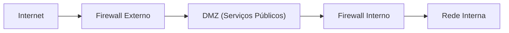
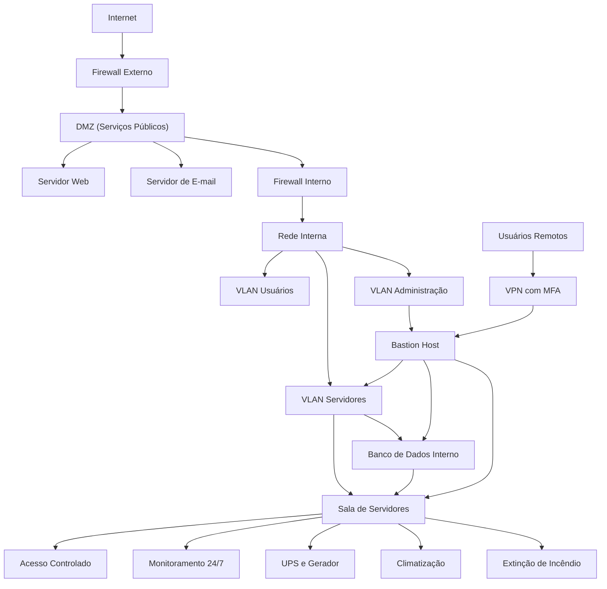

# Aula 06 — Segurança Física e Topologias de Segurança

## 1. Por que Segurança Física é Importante?

Quando pensamos em segurança de sistemas, é comum lembrar de **firewalls, senhas fortes e criptografia**. Mas existe um detalhe que muitos esquecem:
- Se alguém entrar na sala dos servidores e puxar o cabo de energia, todo o sistema cai.

A **segurança física** protege os **ativos que sustentam a tecnologia**: servidores, switches, roteadores, cabos, backups e até notebooks usados no trabalho.

### Exemplos práticos:

* **Tailgating:** um intruso entra junto com um funcionário autorizado, sem ser questionado.
* **Roubo de dispositivos:** levar um HD externo pode ser tão grave quanto um ataque hacker.
* **Instalação de dispositivos maliciosos:** alguém conecta um pen drive ou coloca um sniffer na rede.

### Princípios básicos:

1. **Dissuadir (evitar):** câmeras, alarmes e portas seguras.
2. **Detectar:** sensores de presença, registro de acessos.
3. **Atrasar:** portas reforçadas, racks trancados, “mantraps”.
4. **Responder:** equipe de TI e segurança treinada, plano de ação.


## 2. Controles de Acesso em Ambientes Corporativos

Uma empresa bem estruturada organiza suas áreas em **camadas de segurança**:

* **Perímetro:** portaria, cercas, recepção.
* **Entrada:** crachás, biometria, senhas, MFA (multifator).
* **Zonas de segurança:**

  * Pública → Restrita → Crítica (como a sala de servidores).
* **Controle de visitantes:** crachá temporário, sempre acompanhados.

**Exemplo aplicado:**
Visitantes acessam apenas áreas públicas. Para chegar na sala de servidores, o colaborador precisa de biometria e cartão de acesso. Câmeras gravam tudo por 30 dias.


## 3. Proteção Contra Falhas Ambientais

Um sistema não depende só de software: **energia, temperatura e incêndio também ameaçam a infraestrutura.**

* **Energia:**

  * UPS (no-break) mantém os servidores ligados até o gerador iniciar.
  * Redundância: duas fontes de energia independentes.

* **Climatização (HVAC):**

  * Temperatura ideal: 18–27 °C
  * Umidade: 40–60%
  * Sensores alertam se houver falha.

* **Incêndio:**

  * Detectores de fumaça.
  * Extinção com agentes que não danificam os equipamentos (FM-200, Novec).
  * Planos de evacuação testados.


## 4. Topologias de Segurança em Redes

Na prática de desenvolvimento, os sistemas que criamos **rodam em redes**.
Essas redes precisam ser projetadas para resistirem a ataques.

### Bastion Host

* Servidor “fortificado” usado só para administração segura.
* Exemplo de configuração SSH:

  ```text
  PermitRootLogin no
  PasswordAuthentication no
  AllowUsers admin
  ```

### Screened Network

* Uso de **dois firewalls** para criar uma zona intermediária (DMZ).
* Fluxo:



### DMZ (Zona Desmilitarizada)

* Local para hospedar **serviços públicos** (web, e-mail, DNS).
* Políticas de acesso controlam o tráfego entre Internet, DMZ e rede interna.

### Exemplo Geral



## 5. Exemplo de Arquitetura Segura para Pequena Empresa

* **Perímetro:** firewall UTM com IDS/IPS.
* **DMZ:** web e e-mail.
* **Rede interna:** separada em VLANs (usuários, servidores, administração).
* **Acesso remoto:** VPN com MFA.
* **Administração:** via bastion host.
* **Sala de servidores:** biometria, câmeras, UPS e backup externo.

**Resultado:** mesmo que o site público seja invadido, o banco de dados interno continua protegido.


## 6. Estudo de Caso — Ataque Físico vs Ataque Lógico

* **Físico:** invasor entra na empresa e instala um sniffer de rede.

  * **Mitigação:** mantrap, racks trancados, vigilância.

* **Lógico:** hacker explora falha no site e tenta acessar o banco de dados.

  * **Mitigação:** firewall, WAF, atualizações e logs.

 Segurança eficiente exige **controles físicos + lógicos**.


## 7. Atividade em Grupo

Desenhe a topologia segura de uma empresa que possui:

* Website público
* Servidor de e-mail
* Banco de dados interno
* Funcionários remotos

Inclua: DMZ, firewalls, bastion host, VLANs e medidas físicas (sala de servidores, câmeras, UPS).


## 8. Checklist Rápido

* [ ] Portas das salas críticas com controle de acesso.
* [ ] Racks trancados.
* [ ] UPS e gerador testados.
* [ ] Monitoramento de temperatura e umidade.
* [ ] Backups externos e criptografados.
* [ ] DMZ configurada.
* [ ] Bastion host com logs.
* [ ] Regras de firewall revisadas.

## 9. Questões para Revisão

1. O que é um bastion host e qual seu papel?
2. Cite três controles físicos que protegem servidores.
3. Qual a diferença entre DMZ e rede interna?
4. Por que redundância de energia é essencial?
5. O que a topologia “screened” adiciona de segurança?
