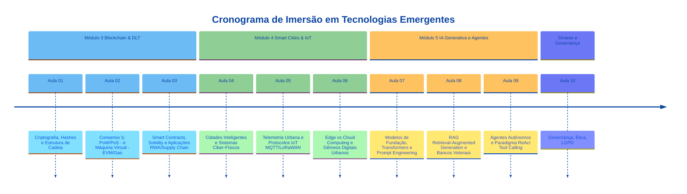

# ISI022 - Sistemas de Informação e Tecnologias Emergentes

**Docente:** Prof. Me. André Cassulino Araújo Souza (`andre.souza@cps.sp.gov.br`)  
**Carga Horária Semanal:** 2 horas-aula semanais (1h40min por encontro)  
**Formato das Aulas:** 1h de Conteúdo Conceitual/Demonstrativo + 40min de Exercício Prático Dirigido  

---

## 1. Apresentação e Ementa Oficial

A disciplina visa capacitar o estudante a compreender, projetar e aplicar tecnologias computacionais de fronteira para solucionar desafios complexos em Sistemas de Informação (SI). O foco transita da fundamentação da Teoria Geral de Sistemas e arquiteturas corporativas tradicionais até as tecnologias emergentes de alto impacto mercadológico e arquitetural.

### Ementa
> *Noções básicas sobre Teoria Geral de Sistemas, Dados e Informação, Tecnologias da Informação e Sistemas de Informação, Classificações e características dos principais Sistemas de Informações. Formas de aplicação da Tecnologia da Informação na organização. Identificação de áreas para negócios em TI. Novas e futuras tecnologias de mercado, ferramentas tecnológicas para desenvolvimento de negócios. Aplicação de tecnologias e oportunidades em Ecossistemas Digitais. Blockchain/Criptomoedas, Smart Cities e Inteligência Artificial Generativa.*

### Competências Desenvolvidas
* **C1:** Conhecer e aplicar tecnologias emergentes para atender às necessidades dos projetos de Sistemas de Informação.
* **C2:** Analisar e propor arquiteturas de Sistemas de Informação alinhadas aos objetivos estratégicos e operacionais das organizações.
* **C3:** Avaliar os impactos das tecnologias da informação e comunicação na sociedade, estruturas de mercado e processos organizacionais, considerando segurança, privacidade (LGPD) e ética.

---

## 2. Conteúdos Já Ministrados (Módulos 1 e 2)

Antes do início do plano intensivo de 10 aulas, foram desenvolvidos e consolidados os seguintes blocos conceituais e arquiteturais:

### Módulo 1: Teoria Geral de Sistemas e Fundamentos dos Sistemas Corporativos Integrados
* **Abordagem Sistêmica nas Organizações (Bertalanffy):** Modelo cibernético de SI $\langle \text{Entradas}, \text{Processamento}, \text{Saídas}, \text{Retroalimentação}, \text{Ambiente} \rangle$, homeostase e entropia negativa organizacional.
* **Hierarquia Epistemológica da Informação (Pirâmide DIKW):** Transição de Dado $\to$ Informação $\to$ Conhecimento $\to$ Sabedoria (Ackoff; Rowley).
* **Taxonomia e Níveis dos Sistemas Integrados:**
  * **SPT / TPS (OLTP):** Processamento transacional de alta frequência e propriedades ACID.
  * **ERP (Enterprise Resource Planning):** Unificação de processos centrais (controladoria, compras, RH, suprimentos).
  * **CRM, SCM e SAD/BI (OLAP):** Relação com clientes, cadeia de suprimentos e suporte à decisão executiva com Data Warehouses e Data Lakes.

### Módulo 2: Ecossistemas Digitais, Plataformas Multilaterais e Economia de APIs
* **Mudança Paradigmática:** Empresas Tradicionais Lineares (*Pipeline*) vs. Plataformas Digitais de Ecossistema (*Platform Ecosystems*) (Parker et al.; Cusumano et al.).
* **Dinâmica de Redes e Lei de Metcalfe:** Efeitos de rede diretos (*same-side*), efeitos de rede indiretos (*cross-side*) e superação do problema de início a frio (*cold-start*).
* **Economia de APIs (*API Economy*):** Padrão RESTful e intercâmbio JSON, *Banking as a Service* (BaaS), *Embedded Finance* e ecossistemas regulados (Pix e Open Finance Brasil).

---

## 3. Diretrizes Metodológicas e Dinâmica de Sala

Cada aula de **1h40min** está rigorosamente estruturada em dois blocos complementares:
1. **Bloco Teórico-Demonstrativo (~1 hora):** Exposição dialogada dos fundamentos conceituais, análise de diagramas arquiteturais e demonstração ao vivo (*live coding* ou análise de ferramentas).
2. **Bloco de Exercício Prático Dirigido (~40 minutos):** Resolução individual ou em duplas de desafios aplicados, análise de casos reais, configuração de ambientes ou desenvolvimento de artefatos práticos com entrega/registro formativo ao final da aula.

---

## 4. Cronograma de 10 Aulas (Módulos 3, 4 e 5)

---

### Bloco A · Módulo 3: Livros-Razão Distribuídos (DLT), Blockchain e Máquinas Virtuais

#### **Aula 01: Fundamentos Criptográficos, Hashes e Arquitetura de Cadeia de Blocos**
* 📓 **Notebook da Aula:** [Aula01_Fundamentos_Blockchain_Criptografia.ipynb](file:///c:/projetos/Material/Sistema%20de%20Informa%C3%A7%C3%A3o%20e%20Tecnologias%20Emergentes/Aula01_Fundamentos_Blockchain_Criptografia.ipynb)
* 🌐 **Simulador Interativo:** [https://blockchaindemo.io/](https://blockchaindemo.io/)
* **Objetivo:** Compreender a superação da autoridade centralizada e o problema dos Generais Bizantinos via registros encadeados.
* **Conteúdo Teórico (1h):**
  * Limitações dos modelos de confiança centralizada (Web 2.0) e pontos únicos de falha (*SPOF*).
  * Criptografia assimétrica de chave pública e privada (ECDSA/secp256k1): autenticidade, autorização e não-repúdio.
  * Funções Hash Criptográficas unidirecionais (SHA-256) e Árvores de Merkle (*Merkle Trees*) para integridade logarítmica $\mathcal{O}(\log n)$.
  * Estrutura do bloco: Cabeçalho, *Previous Hash*, *Nonce*, Timestamp e *Merkle Root*.
  * **O que é REALMENTE Minerar:** empacotamento da *Mempool*, validação de assinaturas, busca pelo *Nonce* por força bruta (PoW) e incentivos econômicos (Coinbase + taxas).
  * **Segurança Patrimonial e Imutabilidade Coletiva:** por que adulterações locais em blocos anteriores são rejeitadas pela rede P2P e **NÃO fazem o usuário perder seus ativos** na cadeia canônica.
* **Exercício Prático (40min):**
  * **Prática:** Simulação interativa no [blockchaindemo.io](https://blockchaindemo.io/) (Hash, Bloco, Mineração, Encadeamento e Consenso Distribuído entre Peers A, B e C).
  * **Entregável:** Questionário de 5 questões dissertativas de análise forense, impacto de adulteração de transações e preservação de saldos em livro-razão distribuído.

#### **Aula 02: Mecanismos de Consenso Distribuído, a Rede Ethereum e a EVM**
* **Objetivo:** Diferenciar modelos de consenso distribuído e analisar a operação computacional da Ethereum Virtual Machine.
* **Conteúdo Teórico (1h):**
  * Comparativo de Consenso: *Proof of Work* (PoW - Bitcoin), *Proof of Stake* (PoS - Ethereum 2.0 / Slashing) e *Proof of Authority* (PoA - redes corporativas/Hyperledger).
  * De moeda descentralizada a computador mundial (*World Computer*): Bitcoin vs. Ethereum.
  * A Máquina Virtual Ethereum (EVM): gerenciamento de estado global e linguagens Turing-completas.
  * Economia computacional do *Gas*: cálculo de taxas, prevenção do problema da parada (*halting problem* / loop infinito) e incentivos de rede.
* **Exercício Prático (40min):**
  * **Prática:** Rastreamento e dissecação forense de transações reais, taxas de Gas, contratos e chamadas de método utilizando o *Etherscan* (Testnet Sepolia).
  * **Entregável:** Ficha técnica dissecando uma transação com interação de contrato (gas limit, gas used, logs de eventos e hashes).

#### **Aula 03: Smart Contracts (Solidity), Tokenização RWA e Aplicações em SI**
* **Objetivo:** Desenvolver, compilar e executar um contrato inteligente autônomo com casos de uso corporativos.
* **Conteúdo Teórico (1h):**
  * Anatomia de um *Smart Contract* (Solidity): variáveis de estado, modificadores de acesso (`public`, `private`, `onlyOwner`), eventos e funções pagáveis (`payable`).
  * Padrões de Token: ERC-20 (fungíveis) e ERC-721/1155 (não-fungíveis).
  * Aplicações Corporativas em SI: Rastreabilidade de cadeia de suprimentos (*Supply Chain*), Tokenização de Ativos do Mundo Real (*Real World Assets - RWA*) e Identidade Auto-Soberana (SSI).
* **Exercício Prático (40min):**
  * **Prática:** Criação, compilação e deploy de um Smart Contract de rastreabilidade ou registro de ativos utilizando o ambiente de desenvolvimento *Remix IDE*.
  * **Entregável:** Execução documentada de escrita e leitura de estado do contrato na máquina virtual de testes do navegador.

---

### Bloco B · Módulo 4: Cidades Inteligentes (*Smart Cities*), Telemetria IoT e Computação de Borda

#### **Aula 04: Cidades Inteligentes, Sistemas Ciber-Físicos (CPS) e Camadas de Infraestrutura**
* **Objetivo:** Mapear a integração entre a malha urbana física e os sistemas de processamento de informação.
* **Conteúdo Teórico (1h):**
  * Transição da cidade tradicional para Cidade Inteligente orientada a dados (*Data-Driven Smart Cities*).
  * Arquitetura em três camadas dos Sistemas Ciber-Físicos (CPS): Sensoriamento/Atuação $\to$ Transporte/Telemetria $\to$ Plataforma Analítica e GIS.
  * Desafios urbanos: monitoramento de enchentes, gestão semafórica adaptativa, resíduos sólidos e iluminação pública inteligente.
* **Exercício Prático (40min):**
  * **Prática:** Estudo de caso guiado: desenho da arquitetura de um Sistema Ciber-Físico municipal para monitoramento hidrológico e emissão de alertas de emergência.
  * **Entregável:** Diagrama de fluxo de dados identificando sensores, interfaces de conversão e atores operacionais.

#### **Aula 05: Telemetria Urbana e Protocolos de Comunicação IoT: MQTT e LoRaWAN**
* **Objetivo:** Compreender os protocolos de transporte leve de dados e implementar comunicação telemétrica *Publish/Subscribe*.
* **Conteúdo Teórico (1h):**
  * Por que HTTP/REST é inadequado para dispositivos de IoT restritos em energia e banda.
  * Protocolo MQTT (*Message Queuing Telemetry Transport*): padrão *Publish/Subscribe*, papéis de *Broker*, *Publisher* e *Subscriber*, níveis de garantia de entrega (QoS 0, 1 e 2).
  * Redes LoRaWAN (*Long Range Wide Area Network*): topologia em estrela, frequência sub-GHz e alcance de longa distância com baixo consumo de bateria.
* **Exercício Prático (40min):**
  * **Prática:** Conexão prática a um broker MQTT público (ex: HiveMQ/Mosquitto Web Client), simulando a publicação e assinatura de tópicos estruturados de telemetria urbana (`cidade/regiao/sensor/metrica`).
  * **Entregável:** Script/payload JSON de telemetria emitido e capturado com diferentes níveis de QoS.

#### **Aula 06: Topologia Computacional: Edge vs. Cloud Computing e Gêmeos Digitais Urbanos**
* **Objetivo:** Avaliar o balanceamento de processamento entre a borda e a nuvem e modelar Gêmeos Digitais dinâmicos.
* **Conteúdo Teórico (1h):**
  * *Cloud Computing* (centralizado, alta capacidade, alta latência) vs. *Edge Computing* (descentralizado, latência $< 10\text{ ms}$, resiliência a desconexões).
  * Critérios de decisão arquitetural para inferência na borda: consumo de banda de rede, privacidade local e decisões de missão crítica (ex: cruzamentos inteligentes).
  * Gêmeos Digitais Urbanos (*Digital Twins*): espelhamento dinâmico em tempo real de infraestruturas físicas, séries temporais e simulações prospectivas (*What-If Analysis*).
* **Exercício Prático (40min):**
  * **Prática:** Exercício de particionamento arquitetural: definir o que deve ser processado no Gateway de Borda (*Edge*) e o que deve ser enviado para o Data Lake em Nuvem em uma frota de transporte público conectada.
  * **Entregável:** Matriz de decisão técnica discriminando dados de borda vs. nuvem, requisitos de latência e gatilhos de alerta.

---

### Bloco C · Módulo 5: Inteligência Artificial Generativa, Engenharia de RAG e Agentes Autônomos

#### **Aula 07: O Salto dos Modelos Preditivos aos Fundacionais: Transformers e LLMs**
* **Objetivo:** Entender a arquitetura Transformer, o mecanismo de Autoatenção e técnicas avançadas de engenharia de prompt corporativo.
* **Conteúdo Teórico (1h):**
  * Evolução da IA em Sistemas de Informação: de modelos discriminativos/estatísticos (regressão, árvore de decisão) aos Modelos de Linguagem de Grande Escala (LLMs).
  * Arquitetura Transformer e mecanismo de Autoatenção (*Self-Attention*): representação contextual bidirecional.
  * Engenharia de Prompt para Sistemas de Informação: *Zero-Shot*, *Few-Shot*, *Chain-of-Thought* (CoT) e geração de saídas estruturadas em JSON compatíveis com schemas de API.
* **Exercício Prático (40min):**
  * **Prática:** Construção de prompts avançados de extração e transformação de dados legados desestruturados (e-mails e chamados de suporte) em saídas estruturadas válidas em JSON para integração em ERPs.
  * **Entregável:** Teste comparativo com validação de consistência sintática do output JSON gerado.

#### **Aula 08: Engenharia de RAG (*Retrieval-Augmented Generation*) e Bancos Vetoriais**
* **Objetivo:** Projetar pipelines de RAG para consulta segura de bases de dados proprietárias de empresas sem risco de alucinações.
* **Conteúdo Teórico (1h):**
  * O problema da alucinação factual e a falta de contexto privado em modelos públicos de fundação.
  * Pipeline de RAG: Extração documental $\to$ Fatiamento (*Chunking*) $\to$ Vetorização com *Embeddings* $\to$ Armazenamento em Bancos Vetoriais (*Vector Databases*).
  * Métricas de Similaridade Semântica (Similaridade por Cosseno e Distância Euclidiana).
  * Injeção de Contexto dinâmico no prompt (*Top-K retrieval*) e citação rastreável de fontes internas.
* **Exercício Prático (40min):**
  * **Prática:** Simulação prática de fatiamento de texto corporativo, conversão em representações vetoriais e realização de busca semântica para montagem do contexto injetado no LLM.
  * **Entregável:** Demonstração do fluxo de busca por similaridade de cosseno retornando o trecho documental correto para responder à dúvida de negócio.

#### **Aula 09: Agentes Autônomos, Paradigma ReAct e Invocação de Ferramentas (*Tool Calling*)**
* **Objetivo:** Compreender a transição de LLMs conversacionais para agentes autônomos capazes de agir sobre sistemas computacionais.
* **Conteúdo Teórico (1h):**
  * Do modelo estático ao Agente Ativo: Ciclo de Percepção $\to$ Raciocínio $\to$ Ação (*Reasoning + Acting - ReAct*).
  * Invocação de Ferramentas (*Function / Tool Calling*): definição de schemas de ferramentas (APIs REST, consultas SQL a bases corporativas, serviços de mensageria).
  * Sistemas Multi-Agente (MAS): colaboração entre agentes especialistas (ex: Agente Pesquisador, Agente Validador e Agente Executor).
  * Mecanismos de tolerância a falhas: auto-correção de parâmetros e reflexão iterativa de erro.
* **Exercício Prático (40min):**
  * **Prática:** Especificação e simulação do plano de execução de um agente ReAct encarregado de resolver uma consulta de cliente consultando uma API de estoque e acionando uma API de emissão de NF.
  * **Entregável:** Roteiro estruturado de *Thought / Action / Observation / Final Answer* do agente simulado.

---

### Bloco D · Integração, Governança e Avaliação

#### **Aula 10: Governança, Ética, LGPD e Apresentação do Projeto Integrador**
* **Objetivo:** Sintetizar os conhecimentos em uma proposta arquitetural unificada, debatendo conformidade legal e riscos contemporâneos.
* **Conteúdo Teórico (1h):**
  * Desafios de Governança de TI Emergente: Lei Geral de Proteção de Dados (LGPD), vazamento de dados corporativos em APIs de IA e direitos autorais.
  * IA Explicável (XAI), viés algorítmico e vulnerabilidades de segurança (injeção de prompt, envenenamento de dados e ataques a smart contracts).
  * Critérios de viabilidade técnico-econômica na adoção de tecnologias emergentes em organizações.
* **Exercício Prático e Avaliação (40min):**
  * **Prática:** Apresentação em formato de *Pitch Arquitetural* das propostas de Projetos Integradores desenvolvidas pelos grupos de alunos.
  * **Requisito do Projeto:** A solução proposta deve resolver um problema organizacional real integrando pelo menos **duas** tecnologias emergentes estudadas (ex: *Smart Cities + RAG corporativo* ou *Blockchain + Telemetria IoT*).
  * **Entregável:** Defesa técnica com diagrama arquitetural e rubrica avaliativa formativa/somativa.

---

## 5. Matriz de Resumo do Cronograma (Aulas 1 a 10)

| Aula | Módulo | Tema Central | Atividade Prática (40 min) | Entregável da Aula |
| :---: | :---: | :--- | :--- | :--- |
| **01** | M3 | Criptografia, Hashes e Estrutura de Blockchain | Simulação interativa de mineração e quebra em cadeia | Análise de imutabilidade e efeito avalanche |
| **02** | M3 | Consenso (PoW/PoS), EVM e Economia do Gas | Análise forense de transações reais no Etherscan | Ficha técnica de transação e consumo de Gas |
| **03** | M3 | Smart Contracts (Solidity), Tokenização e RWA | Deploy e interação com Smart Contract no Remix IDE | Execução de contrato autônomo na EVM |
| **04** | M4 | Cidades Inteligentes e Sistemas Ciber-Físicos (CPS) | Modelagem arquitetural de solução para crise hídrica/urbana | Diagrama de fluxo do Sistema Ciber-Físico |
| **05** | M4 | Telemetria Urbana e Protocolos IoT (MQTT/LoRaWAN) | Publicação e assinatura telemétrica em Broker MQTT | Payloads telemétricos capturados com QoS |
| **06** | M4 | Edge vs. Cloud Computing e Gêmeos Digitais | Particionamento de dados e desenho de Digital Twin | Matriz de decisão de borda e simulação What-If |
| **07** | M5 | Transformers, Modelos de Fundação e Prompting | Engenharia de prompt para saídas estruturadas em JSON | Prompt validado gerando payloads para SI |
| **08** | M5 | Engenharia de RAG e Bancos de Dados Vetoriais | Pipeline de chunking, embedding e busca semântica | Consulta semântica com contexto corporativo |
| **09** | M5 | Agentes Autônomos, ReAct e Tool/Function Calling | Simulação de agente com chamadas de ferramentas e APIs | Roteiro ReAct (Pensamento/Ação/Observação) |
| **10** | M3/4/5 | Governança (LGPD/Ética) e Projeto Integrador | Apresentação em formato Pitch da Arquitetura Proposta | Defesa técnica da solução emergente integrada |

---

## 6. Critérios de Avaliação

A disciplina adota instrumentos avaliativos formativos e somativos:

1. **Avaliação Formativa Contínua (50%):**
   * Participação ativa e entregas dos exercícios práticos ao final de cada encontro (aulas 1 a 9).
   * Rubrica com foco em resolução de problemas, capacidade analítica e rigor conceitual.
2. **Avaliação Somativa - Projeto Integrador (50%):**
   * Desenvolvimento em grupo e defesa de proposta arquitetural de Sistema de Informação incorporando tecnologias emergentes.
   * Critérios: clareza arquitetural, viabilidade de implementação, governança (segurança/LGPD) e coerência na escolha tecnológica.

---

## 7. Bibliografia de Apoio

### Bibliografia Básica
* LAUDON, Kenneth C.; LAUDON, Jane P. **Sistemas de Informação Gerenciais**. 14. ed. São Paulo: Pearson, 2022.
* TURBAN, Efraim; POLLARD, Carol; WOOD, Gregory. **Tecnologia da Informação para Gestão**: Em Busca do Melhor Desempenho Estratégico e Operacional. 11. ed. Porto Alegre: Bookman, 2021.
* STAIR, Ralph M.; REYNOLDS, George W. **Princípios de Sistemas de Informação**. 12. ed. São Paulo: Cengage Learning, 2018.

### Bibliografia Específica e Tecnologias Emergentes
* ANTONOPOULOS, Andreas M.; WOOD, Gavin. **Mastering Ethereum**: Building Smart Contracts and DApps. Sebastopol: O'Reilly Media, 2018.
* NAKAMOTO, Satoshi. **Bitcoin: A Peer-to-Peer Electronic Cash System**. 2008. Disponível em: <https://bitcoin.org/bitcoin.pdf>.
* AL-FUQAHA, Ala et al. **Internet of Things: A Survey on Enabling Technologies, Protocols, and Applications**. IEEE Communications Surveys & Tutorials, v. 17, n. 4, p. 2347-2376, 2015.
* BATTY, Michael et al. **Smart cities of the future**. The European Physical Journal Special Topics, v. 214, n. 1, p. 481-518, 2012.
* LEWIS, Patrick et al. **Retrieval-Augmented Generation for Knowledge-Intensive NLP Tasks**. Advances in Neural Information Processing Systems (NeurIPS), v. 33, p. 9459-9474, 2020.
* VASWANI, Ashish et al. **Attention Is All You Need**. Advances in Neural Information Processing Systems (NeurIPS), v. 30, 2017.
* YAO, Shunyu et al. **ReAct: Synergizing Reasoning and Acting in Language Models**. International Conference on Learning Representations (ICLR), 2023.
