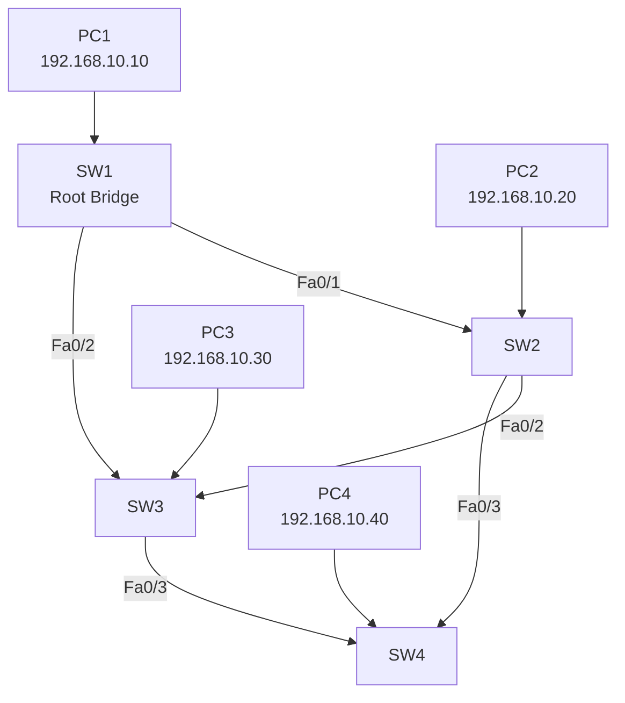

# Redundância em Redes

Em redes corporativas, a comunicação entre dispositivos precisa permanecer disponível o máximo possível. Empresas dependem da rede para acessar sistemas, servidores, internet, bancos de dados, telefonia IP e diversos serviços críticos.

Se existir apenas um único caminho entre switches, qualquer falha física pode interromper completamente a comunicação da rede.

Exemplo:

```text id="1f3k1u"
PCs → Switch → Servidor
```

Se o link entre os switches falhar:

* usuários perdem acesso aos sistemas;
* arquivos não podem ser acessados;
* serviços param de funcionar;
* ocorre indisponibilidade da rede.

Por esse motivo utilizamos:

```text id="m7u0ah"
Redundância
```

---

# O que é Redundância?

Redundância significa criar caminhos alternativos na rede.

Exemplo:

```text id="pd8it7"
SW1 ----- SW2
 |         |
 |         |
SW3 -------
```

Agora existem múltiplos caminhos entre os switches.

Se um link falhar:

* outro caminho pode assumir automaticamente;
* a comunicação continua funcionando;
* a rede ganha alta disponibilidade.

---

# Problema da Redundância em Redes Ethernet

Embora a redundância aumente a disponibilidade, ela cria um novo problema:

```text id="x5ecoz"
Loops de Camada 2
```

---

# O que é um Loop?

Em redes Ethernet, switches encaminham quadros broadcast para todas as portas.

Com caminhos redundantes, os quadros podem circular indefinidamente pela rede.

Exemplo:

```text id="uxm7ws"
SW1 → SW2 → SW3 → SW1 → SW2 → SW3...
```

Isso gera:

* Broadcast Storm;
* duplicação de quadros;
* instabilidade;
* sobrecarga dos switches;
* lentidão extrema;
* queda da rede.

---

# Solução: STP

O Spanning Tree Protocol foi criado justamente para permitir:

✅ Redundância
✅ Alta disponibilidade
✅ Sem causar loops

---

# Como o STP Resolve o Problema?

O STP analisa a topologia da rede e:

1. escolhe um switch principal (Root Bridge);
2. calcula os melhores caminhos;
3. bloqueia automaticamente links redundantes;
4. mantém caminhos alternativos em espera.

Assim:

* não existe loop;
* a redundância permanece disponível;
* caso um link falhe, o STP libera automaticamente outro caminho.

---

# Exemplo Conceitual

## Sem STP

```text id="a1d2ep"
SW1 ----- SW2
 |         |
 |         |
SW3 -------
```

Todos os links ativos:

❌ Loop acontece

---

## Com STP

```text id="j15dyl"
SW1 ----- SW2
 |          
 |          
SW3 -------X
```

Uma porta é bloqueada:

✅ Sem loop
✅ Redundância preservada

---

# Objetivo do Laboratório

Neste laboratório você irá:

* compreender a importância da redundância;
* identificar problemas de loop em Layer 2;
* configurar o STP;
* definir um Root Bridge;
* identificar portas bloqueadas;
* simular falhas;
* verificar a reconvergência da rede;
* analisar alta disponibilidade em ambientes corporativos.

---

# Topologia do Laboratório



---

# ETAPA 1 — Verificar Comunicação Inicial

Como os PCs já possuem IP configurado, o primeiro passo é validar a conectividade.

No PC1:

```bash id="ml7fxm"
ping 192.168.10.20
```

Depois:

```bash id="a4zsmj"
ping 192.168.10.30
ping 192.168.10.40
```

Objetivo:

✅ Garantir que a rede esteja funcionando antes da análise do STP.

---

# ETAPA 2 — Identificar a Redundância

Observe a topologia e responda:

* Quantos caminhos existem entre os switches?
* Onde existe redundância?
* Quais links poderiam assumir caso outro falhe?

O aluno deve perceber que existem:

```text id="wqj1ib"
múltiplos caminhos entre os switches
```

e isso cria possibilidade de loop.

---

# ETAPA 3 — Verificar STP Atual

Em qualquer switch:

```bash id="0odly0"
enable
show spanning-tree
```

---

# O que observar?

O switch exibirá:

* Root Bridge;
* Root Port;
* portas Designated;
* possíveis portas Blocking.

---

# ETAPA 4 — Definir Manualmente o Root Bridge

Agora vamos forçar o SW1 a ser o switch principal.

No SW1:

```bash id="l5jlwm"
enable
configure terminal
spanning-tree vlan 1 priority 4096
```

---

# Por que fazer isso?

O STP escolhe o switch com menor prioridade.

Por padrão:

```text id="n2y0yg"
32768
```

Ao definir:

```text id="rdmlyv"
4096
```

o SW1 terá prioridade maior na eleição.

---

# ETAPA 5 — Salvar Configuração

```bash id="n6vkjg"
end
write
```

---

# ETAPA 6 — Verificar Nova Eleição

Agora execute:

```bash id="9mbmgo"
show spanning-tree
```

No SW1 deverá aparecer:

```text id="62djlwm"
This bridge is the root
```

---

# ETAPA 7 — Identificar Portas do STP

Analise:

| Tipo            | Função                  |
| --------------- | ----------------------- |
| Root Port       | Melhor caminho até Root |
| Designated Port | Porta ativa do segmento |
| Blocking        | Porta bloqueada         |

---

# ETAPA 8 — Descobrir Porta Bloqueada

Como existe redundância, o STP irá bloquear um caminho.

O aluno deve identificar:

✅ Qual interface foi bloqueada <br>
✅ Qual o motivo do bloqueio

---

# ETAPA 9 — Simular Falha

No SW1:

```bash id="5b8ehh"
configure terminal
interface fa0/1
shutdown
```

---

# O que aconteceu?

O link:

```text id="f9r9mq"
SW1 ↔ SW2
```

foi interrompido.

---

# ETAPA 10 — Observar Reconvergência

Execute:

```bash id="vovqdw"
show spanning-tree
```

Agora o STP irá:

* recalcular a topologia;
* liberar a porta anteriormente bloqueada;
* restaurar o caminho alternativo.

---

# ETAPA 11 — Testar Alta Disponibilidade

No PC1:

```bash id="0c2ep4"
ping 192.168.10.20
```

Se continuar funcionando:

✅ Redundância funcionou <br>
✅ Alta disponibilidade garantida

---

# ETAPA 12 — Restaurar Link

```bash id="l3xpj8"
interface fa0/1
no shutdown
```

O STP fará nova convergência.

---

# ETAPA 13 — Testar RSTP

Em todos os switches:

```bash id="4typsf"
configure terminal
spanning-tree mode rapid-pvst
```

---

# Comparação

| STP                | RSTP                |
| ------------------ | ------------------- |
| Convergência lenta | Convergência rápida |
| 30-50 segundos     | 1-6 segundos        |
| IEEE 802.1D        | IEEE 802.1w         |

---

# Conclusão

Ao final do laboratório o aluno deverá compreender:

✅ Importância da redundância <br>
✅ Problemas de loop em Layer 2 <br>
✅ Funcionamento do STP <br>
✅ Eleição do Root Bridge <br>
✅ Bloqueio de portas redundantes <br>
✅ Alta disponibilidade <br>
✅ Reconvergência da rede <br>
✅ Diferenças entre STP e RSTP
